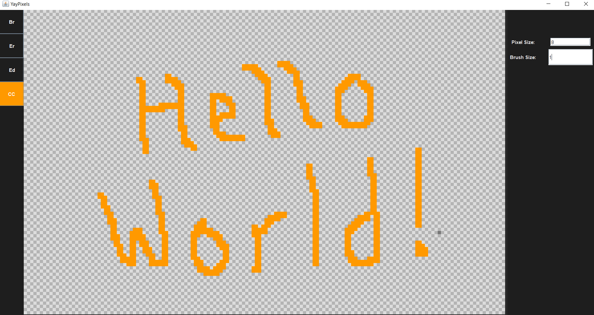

# YayPixels
A pixel art creation tool written in Java using Swing!

## Layout
The UI of this application consists of numerous components, each written in its own .java file.

### Primary Files
* Window.java: The starting point of the application
* Layout.java: Dictates the layout of the main components. The Toolbar components are placed on the left, the RightBar components are placed on the right, and the Canvas is placed in the center
* Canvas.java: Contains the logic for updating and rendering the Canvas

### Toolbars
Each toolbar is treated as a single component by Layout.java. However, internally each toolbar also stores a grid of ButtonPanels.

### Tools
Each ButtonPanel is used for a single tool. Each tool inherits the ToolInterface at ToolInterface.java and is populated by its own logic.

Toolhandler.java contains the logic for selecting a tool and modifing the canvas. When a tool is used, ToolHandler.java is responsible for applying the action to the canvas.
